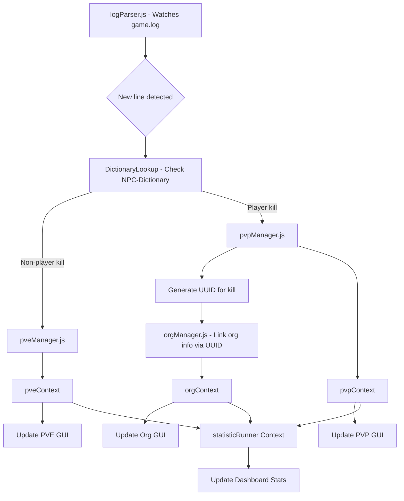

# Statizen

A desktop application for tracking Star Citizen statistics and performance metrics, built with React, Vite, and Tauri.

⚠️ **Currently Under Development**

This application is actively being developed and does not work in its current state. The current version is 0.1.0 and is not yet ready for production use.

## Installation

Download the latest Statizen Installer
[Latest Release](https://github.com/ChrisNSki/Statizen/latest)

## About

Statizen is a free, open-source desktop application designed to help Star Citizen players track their combat performance, mission statistics, and gameplay metrics. The application provides detailed insights into PVP and PVE activities, helping players analyze their performance and improve their gameplay.

> This project is built by one developer in the community and maintained in spare time.  
> If Statizen helps you and you’d like to support its ongoing development:
>
> [🌯 Buy Me a Torpedo Burrito](https://buymeacoffee.com/chrisnarow5)

## Features

- **Dashboard Overview**: Real-time display of current location, K/D ratios, and recent activity
- **PVP Statistics**: Track player vs player combat performance with detailed kill/death ratios
- **PVE Statistics**: Monitor NPC combat performance
- **Ship Performance**: Track statistics for different ships and their combat effectiveness

## App Flow



## Getting Started

### Prerequisites for building (generating your own .msi or .exe)

- Node.js (v18 or higher)
- Rust (for Tauri development)
- Star Citizen game client

### Installation For Development

1. Clone the repository:

```bash
git clone <repository-url>
cd statizen
```

2. Install dependencies:

```bash
npm install
```

3. Run the development server:

```bash
npm run dev
```

4. For desktop development with Tauri:

```bash
npm run tauri dev
```

### Building

To build the desktop application:

```bash
npm run tauri build
```

## License

This project is free to use and open source.

## Contributing

Contributions are welcome! This project is under active development and we appreciate any help with:

- Bug reports and fixes
- Feature requests and implementations
- UI/UX improvements
- Documentation updates

### How to Contribute

#### 1. Fork the Repository

First, fork this repository to your own GitHub account by clicking the "Fork" button at the top of the page.

#### 2. Clone Your Fork

```bash
git clone https://github.com/YOUR_USERNAME/statizen.git
cd statizen
```

#### 3. Create a Branch

Always create a new branch for your changes. Follow our branch naming convention:

**Branch Naming Convention:**

- `feature/description-of-feature` - for new features
- `fix/description-of-bug` - for bug fixes
- `docs/description-of-changes` - for documentation updates
- `refactor/description-of-refactor` - for code refactoring
- `style/description-of-styling` - for UI/UX improvements

**Examples:**

```bash
git checkout -b feature/add-pve-statistics
git checkout -b fix/dashboard-layout-issue
git checkout -b docs/update-installation-guide
git checkout -b refactor/optimize-data-fetching
```

#### 4. Make Your Changes

- Write clear, readable code
- Follow the existing code style and conventions
- Add comments where necessary
- Test your changes thoroughly

#### 5. Commit Your Changes

Use clear, descriptive commit messages:

```bash
git add .
git commit -m "feat: add PVE statistics tracking functionality"
git commit -m "fix: resolve dashboard layout overflow issue"
git commit -m "docs: update installation instructions for Windows"
```

**Commit Message Format:**

- `feat:` for new features
- `fix:` for bug fixes
- `docs:` for documentation changes
- `style:` for formatting changes
- `refactor:` for code refactoring
- `test:` for adding or updating tests

#### 6. Push Your Branch

```bash
git push origin your-branch-name
```

#### 7. Create a Merge Request (Pull Request)

1. Go to your forked repository on GitHub
2. Click "Compare & pull request" for your branch
3. Fill out the merge request template:
   - **Title**: Clear, concise description of changes
   - **Description**: Detailed explanation of what was changed and why
   - **Type of Change**: Select the appropriate category
   - **Testing**: Describe how you tested your changes
   - **Screenshots**: If applicable, include screenshots of UI changes

**Merge Request Template:**

```markdown
## Description

Brief description of the changes made

## Type of Change

- [ ] Bug fix (non-breaking change which fixes an issue)
- [ ] New feature (non-breaking change which adds functionality)
- [ ] Breaking change (fix or feature that would cause existing functionality to not work as expected)
- [ ] Documentation update

## Testing

- [ ] Tested locally
- [ ] All existing tests pass
- [ ] New tests added for new functionality

## Screenshots

If applicable, add screenshots to help explain your changes.

## Checklist

- [ ] My code follows the style guidelines of this project
- [ ] I have performed a self-review of my own code
- [ ] I have commented my code, particularly in hard-to-understand areas
- [ ] My changes generate no new warnings
- [ ] I have added tests that prove my fix is effective or that my feature works
```

#### 8. Code Review Process

- Your merge request will be reviewed by maintainers
- Address any feedback or requested changes
- Once approved, your changes will be merged into the main branch

### Development Guidelines

#### Code Style

- Use consistent indentation (2 spaces)
- Follow React best practices
- Use meaningful variable and function names
- Keep functions small and focused

#### Testing

- Test your changes thoroughly before submitting
- Ensure the application builds and runs correctly
- Test both web and desktop versions if applicable

#### Documentation

- Update documentation for any new features
- Include inline comments for complex logic
- Update README.md if installation or usage instructions change

### Getting Help

If you need help with contributing:

- Open an issue for questions or discussions
- Check existing issues and merge requests for similar problems

Thank you for contributing to Statizen!

## Disclaimer

This application is not affiliated with Cloud Imperium Games or the official Star Citizen development team. It is a third-party tool created by the community for the community.

## Technology Stack

- **Frontend**: React 19 with Vite for fast development and building
- **Desktop Framework**: Tauri 2.5 for cross-platform desktop application
- **UI Components**: Custom components built with Tailwind CSS and Radix UI
- **Routing**: React Router DOM for navigation
- **Icons**: Lucide React for consistent iconography
